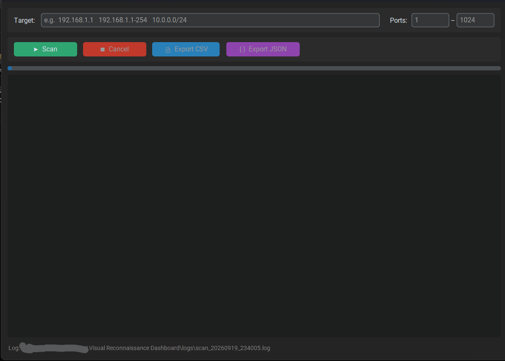
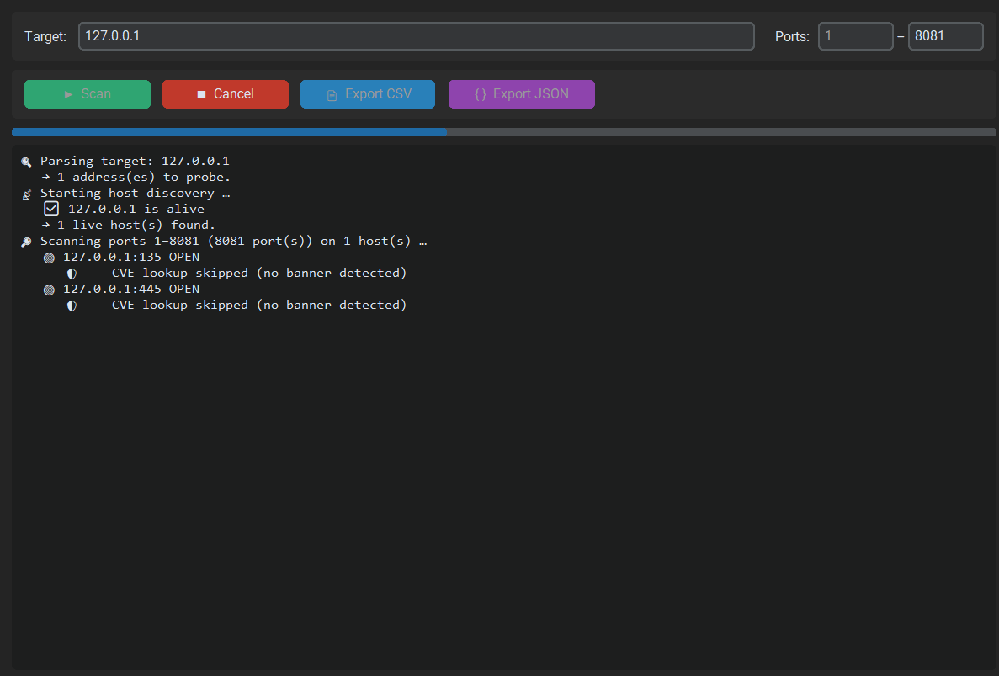
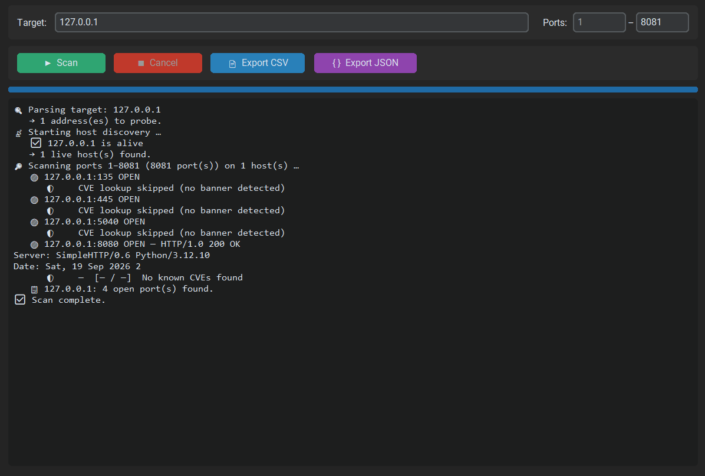

# Visual Reconnaissance Dashboard

A lightweight Python desktop application for network reconnaissance.  
Scan hosts, discover open ports, grab service banners — all from a modern dark-themed GUI.

---

## Features

| Feature | Details |
|---|---|
| **Target parsing** | Single IP, dash-range (`192.168.1.1-254`), and CIDR (`10.0.0.0/24`) |
| **Host discovery** | Fast TCP-connect probes on common ports + ICMP ping fallback — no admin privileges needed |
| **Port scanning** | Configurable port range with multithreaded TCP-connect checks |
| **Banner grabbing** | Automatic service/version identification on open ports |
| **CVE correlation** | Queries the [NVD REST API v2.0](https://services.nvd.nist.gov/rest/json/cves/2.0) to find known CVEs for detected services — shows CVE ID, description, and CVSS severity |
| **Live results** | Streaming output in the GUI as the scan progresses — not just at the end |
| **Cancel support** | Cooperative cancellation so you can stop a scan at any time |
| **Export** | One-click export to **CSV** or **JSON** (includes CVE columns) |
| **Logging** | Every session writes a timestamped UTF-8 log file under `logs/` |
| **No raw sockets** | Uses only `socket` + `subprocess` — runs on standard user accounts |

---

## Screenshots

> _Replace the placeholders below with actual screenshots after running the app._

### Main Window  


### Scan In Progress  


### Scan Complete  


---

## Requirements

- **Python 3.10+**
- [customtkinter](https://github.com/TomSchimansky/CustomTkinter) (the only external dependency)

---

## Setup

### 1. Clone / download the project

```bash
cd "Visual Reconnaissance Dashboard"
```

### 2. (Recommended) Create a virtual environment

```bash
python -m venv venv
venv\Scripts\activate        # Windows
# source venv/bin/activate   # macOS / Linux
```

### 3. Install dependencies

```bash
pip install customtkinter
```

### 4. Run the application

```bash
python dashboard.py
```

---

## Project Structure

```
Visual Reconnaissance Dashboard/
├── dashboard.py        # GUI entry point (CustomTkinter)
├── scanner.py          # Network scanning backend (stdlib only)
├── cve_lookup.py       # CVE correlation via NVD API (self-contained)
├── README.md           # This file
├── logs/               # Auto-created; one log file per session
│   └── scan_YYYYMMDD_HHMMSS.log
└── screenshots/        # Placeholder for README images
```

---

## Usage

1. Enter a target in one of the supported formats:
   - `192.168.1.1` — single host  
   - `192.168.1.1-254` — last-octet range  
   - `192.168.1.0/24` — CIDR subnet  
2. Optionally adjust the port range (defaults to **1 – 1024**).
3. Click **Scan** and watch live results stream in.
4. Click **Cancel** to stop a scan early.
5. Once finished, use **Export CSV** or **Export JSON** to save results.

---

## Logging

All scan activity — start, stop, hosts found, errors — is logged to a timestamped file in the `logs/` directory.  
The current log path is displayed in the status bar at the bottom of the window.

---

## License

This project is provided as-is for educational and authorized testing purposes only.  
**Only scan networks you own or have explicit permission to test.**

